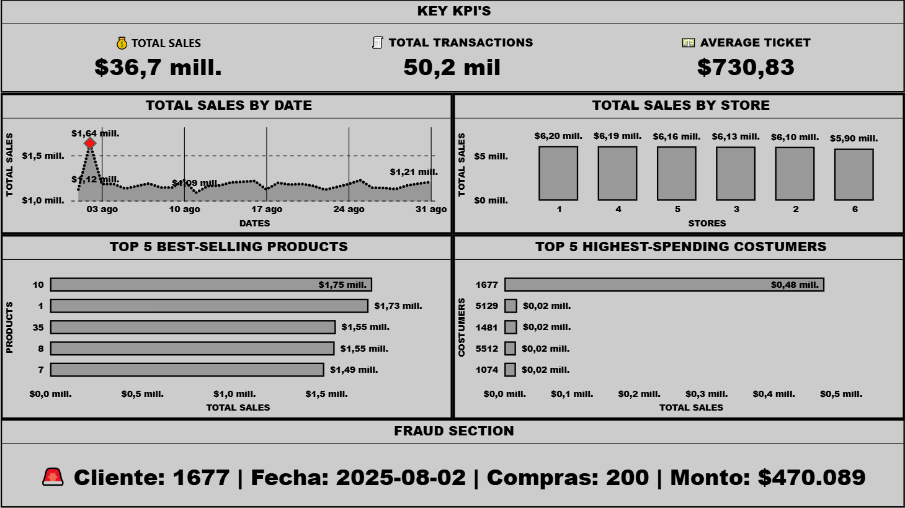

# 🛒 Retail Fraud Analysis & Sales Intelligence

## 📷 Project Preview



---

## 📌 Overview

End-to-end data analytics project focused on **fraud detection in retail transactions** and **business performance analysis**.

This project simulates a real-world retail environment, combining:

- Data generation (Python)
- SQL data analysis
- Dashboard visualization
- Automated executive reporting (PDF)

---

## 🎯 Objectives

- Detect and analyze fraudulent transactions  
- Identify high-risk customers  
- Evaluate sales performance across stores and products  
- Deliver an automated executive-level report  

---

## 🧱 Tech Stack

- **Python** (Pandas, ReportLab)
- **MySQL**
- **SQL**
- **Power BI / Data Visualization**
- **Git & GitHub**

---

## 🧠 Business Problem

Retail companies face significant losses due to fraudulent transactions, including abnormal purchasing behavior, refund abuse, and suspicious patterns.

This project aims to simulate a retail environment and identify potential fraud signals through data analysis and visualization.
---

## 📂 Project Structure
```
Retail-Fraud-Analysis/
│
├── Dashboard/ → Dashboard file
├── Data/ → Generated or source data
├── Images/ image preview
├── Output/ → Generated PDF report
├── Script/ → Python scripts
│ ├── generate_data.py
│ └── retail_fraud_report.py
│
├── SQL/
│ ├── sales.db → Database structure (tables)
│ └── sales_queries.sql → Analysis queries
│
└── README.md
```

---
## ⚙️ Project Architecture

1. Data generation (Python)
2. Data storage (MySQL)
3. Data analysis (SQL queries)
4. Visualization (Power BI dashboard)
5. Reporting (automated PDF generation)

---
## 🗄️ SQL Analysis

📍 **Path:** `Script/queries.sql`

Key queries include:
- Fraud detection rules
- Customer behavior analysis
- Transaction anomalies

---
## ⚙️ Project Architecture

1. Data generation (Python)
2. Data storage (MySQL)
3. Data analysis (SQL queries)
4. Visualization (Power BI dashboard)
5. Reporting (automated PDF generation)

---
## 📊 Dashboard

Interactive Power BI dashboard for fraud detection.

📍 **Path:** `Dashboard/dashboard.pbix`

### Key insights:
- High-risk customers
- Suspicious transaction patterns
- Fraud distribution
---

## 📊 Key Business Metrics

- 💰 **Total Sales**  
- 🧾 **Average Ticket**  
- 👥 **Total Customers**  
- 🚨 **Fraud Rate**  
- 🏬 **Sales by Store**  
- 📦 **Sales by Product**  

---

## 🚨 Fraud Analysis Approach

Fraud detection is based on flagged transactions and analyzed through:

- Fraud frequency per customer  
- Fraud ratio (fraud / total transactions)  
- Identification of high-risk customers  

---

## 📈 Dashboard

The dashboard provides a visual overview of:

- Sales performance  
- Fraud distribution  
- Key KPIs  

📍 Located in:

`Dashboard/DashboardP2.pbix`

---

## 📄 Automated Executive Report

A professional PDF report is automatically generated using Python.

### Includes:

- Executive summary  
- Key business KPIs  
- Fraud insights  
- Top high-risk customers  
- Sales breakdown by store and product  

📍 Output file:
`Output/retail_fraud_report.pdf`


---

## 🚀 How to Run

Follow these steps to execute the full retail fraud analysis pipeline:

### 1️⃣ Generate Synthetic Data
Run the Python script to create simulated retail transaction data.

```bash
python Script/data_generator.py
```

---

### 2️⃣ Load Data into Database
Import the generated data into your MySQL database.

> Make sure your database connection is properly configured.

---

### 3️⃣ Run SQL Analysis
Execute the SQL queries to analyze transactions and detect potential fraud patterns.

📍 **Path:** `Script/queries.sql`

---

### 4️⃣ Explore the Dashboard
Open the Power BI dashboard to visualize fraud insights and patterns.

📍 **Path:** `Dashboard/dashboard.pbix`

---

### 5️⃣ Generate Automated Report
Run the reporting script to generate a PDF with key findings.

```bash
python Script/report_generator.py
```

📄 **Output:** `Output/retail_fraud_report.pdf`

---

## 🧩 End-to-End Workflow

1. Data generation (Python)  
2. Data storage (MySQL)  
3. Data analysis (SQL)  
4. Visualization (Power BI)  
5. Reporting (PDF automation)

🚀 Project Highlights

✔ End-to-end data pipeline
✔ Business-focused analysis
✔ Fraud detection use case
✔ Automated reporting (PDF)
✔ Clean and structured project

📦 Requirements

Create a requirements.txt file with:
pandas
mysql-connector-python
reportlab

👤 Author

Klaus
Data Analyst | SQL | Python | Business Analytics

📌 Notes

This project is designed for portfolio purposes and simulates a real retail analytics scenario with a focus on fraud detection.
